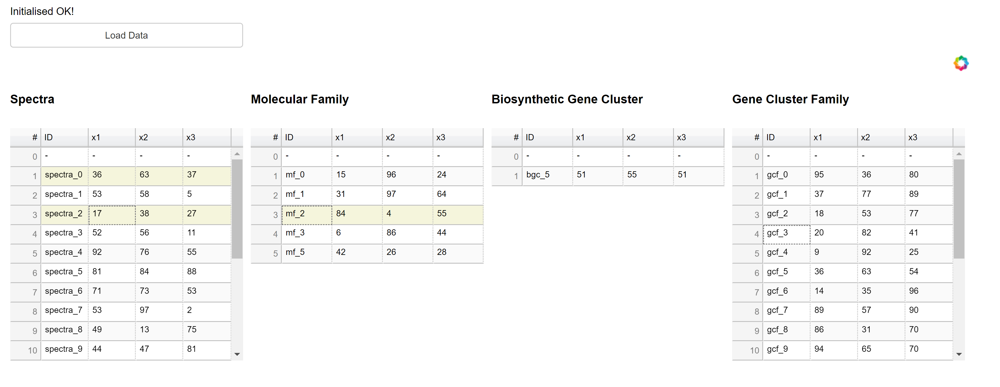

# bokeh_linker_widget

A simple example on linked multiple data tables in Bokeh. Clicking one table will filter the entries on other tables.



#### Installation

1. Clone this repo and `cd` to it.
2. Run `$ pipenv install` to create virtual environment and all its dependencies. Python 3.7 is required.
3. Go into the virtual environment: `$ pipenv shell`.
4. Run bokeh server: `$ bokeh serve --show myapp`. This launches the demo app.

To run the demo, first click the **Load Data** button. Then click on entries in a table to see other tables 
being filtered according to their links. 

Links are defined between adjacent tables for the following item indices:
```
link_indices = [(1, 1), (1, 2), (1, 3), (1, 4), (2, 4), (2, 5), (3, 6)]
```
(for more details, [see the following](https://github.com/joewandy/bokeh-linker-widget/blob/master/myapp/main.py#L20-L23)).

